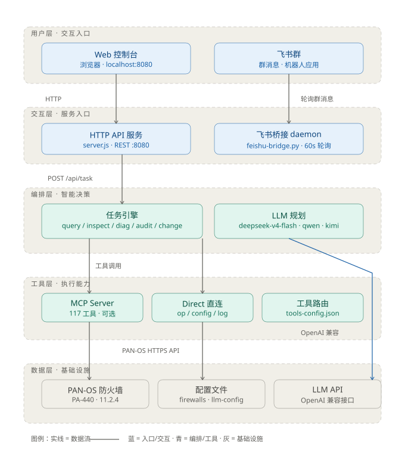
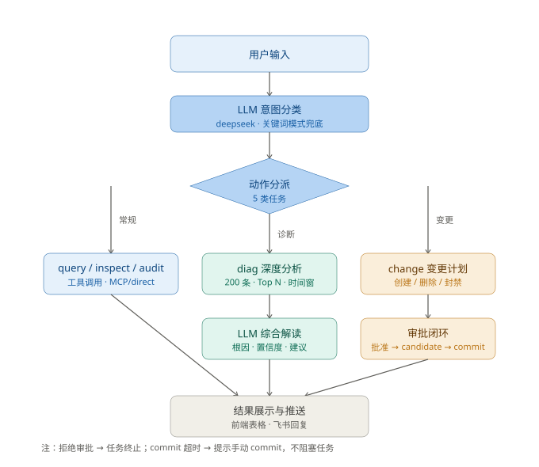

# Palo Alto Networks 防火墙监控运维数字员工

基于 PAN-OS API + LLM 的防火墙智能运维控制台。支持 Web 控制台与飞书双通道交互，任务引擎驱动 5 类运维场景（查询 / 巡检 / 诊断 / 审计 / 变更审批），LLM 参与意图规划与诊断推理。

> 🚀 **零 WorkBuddy 运行时依赖**：纯 Node.js 实现，可独立部署（见 `standalone/`）。打包交付方案见 [`docs/PACKAGING-DEPLOY.md`](docs/PACKAGING-DEPLOY.md)。

## 目录结构

```
Palo-Alto-Firewall-Agent-Console/
├── README.md                 # 本文件
├── .gitignore                # 敏感文件/依赖/产物排除规则
├── diagrams/                 # 架构规划图（SVG）
│   ├── architecture.svg      # 系统架构图（5 层）
│   └── task-flow.svg         # 任务处理流程图（3 分支 + 审批闭环）
├── docs/
│   ├── DEPLOY.md             # 部署指南
│   ├── paloalto-firewall-agent-spec.md  # 需求规格
│   └── PACKAGING-DEPLOY.md   # 打包部署指南（macOS/Windows/Linux + 脱敏）
├── webui/                    # 控制台（开发/运行版，含全部源码）
│   ├── server.js             # 后端（纯 Node http + MCP SDK 可选）
│   ├── index.html            # 前端（商业化监控 UI）
│   ├── start.sh              # 启动脚本
│   ├── llm-config.example.json  # 模型配置模板（复制为 llm-config.json 填写 key）
│   ├── tools-config.json     # 工具级路由（mcp / direct / auto）
│   └── *.bak                 # 检查点（可回退，不入库）
├── standalone/               # 零 WorkBuddy 依赖部署包（系统 node 即可跑）
├── cfgs/
│   ├── firewalls.example.json # 防火墙配置模板（复制为 firewalls.json 填写）
│   └── firewalls.json        # 真实配置（gitignore，不入库）
├── feishu-bridge.py          # 飞书桥接 daemon（轮询群消息 → 调控制台 /api/task）
├── scripts/build-app.sh      # macOS .app 打包脚本（自动脱敏）
└── package-lock.json
```

## 系统架构



五层：用户层（Web 控制台 / 飞书群）→ 交互层（HTTP API / 飞书桥接）→ 编排层（任务引擎 + LLM 规划）→ 工具层（MCP 117 工具可选 / Direct 直连 / 工具路由）→ 数据层（PAN-OS / 配置 / LLM API）。

## 任务处理流程



用户输入 → LLM 意图分类 → 动作分派（常规 query/inspect/audit / 诊断 diag 深度分析+LLM 综合 / 变更 change 审批闭环）→ 结果展示 / 飞书推送。

## 快速启动

```bash
# 1. 配置防火墙（API key）
cp standalone/firewalls.example.json webui/../firewalls.json   # 或修改对应路径
# 实际使用：PANOS_FIREWALLS_CONFIG 指向 firewalls.json（含 host + api_key）

# 2. 启动控制台（默认 :8080）
cd webui && ./start.sh

# 3. （可选）飞书桥接 daemon
export FEISHU_APP_ID="cli_xxx" FEISHU_APP_SECRET="xxx" FEISHU_CHAT_ID="oc_xxx"
python3 feishu-bridge.py --daemon
```

浏览器打开 `http://localhost:8080`（或经 `?v=<时间戳>` 绕过缓存）。

## 核心能力

| 能力 | 说明 |
|---|---|
| 监控 KPI | 设备 / HA / 会话（进度条）/ 负载内存 / 许可证，10s 自动刷新 |
| 5 类任务 | query 查询 · inspect 合规巡检 · diag 诊断（日志深度分析 + LLM 根因）· audit 配置审计 · change 变更审批闭环 |
| LLM 规划 | deepseek-v4-flash / qwen / kimi，模型配置可运行时编辑（llm-config.json） |
| 飞书控制 | 群消息 → 任务执行 → 结果回复；审批闭环从飞书操作 |
| 工具路由 | tools-config.json 按工具指定 mcp / direct / auto |
| 零依赖部署 | standalone/ 纯系统 node 可运行（无 WorkBuddy 依赖） |

## 关键配置

- `webui/llm-config.json` — 模型提供方（label / base_url / model / env / key），0600 权限
- `webui/tools-config.json` — 工具级路由
- `PANOS_FIREWALLS_CONFIG` — 防火墙配置路径（host + api_key）
- 环境变量：`DEEPSEEK_API_KEY` / `QWEN_API_KEY` / `KIMI_API_KEY`（start.sh 或模型配置面板）

## 排错

```bash
tail -f /tmp/webui.log            # 控制台日志
curl http://localhost:8080/api/tasks      # 任务状态
curl http://localhost:8080/api/llm/log    # LLM 决策日志
curl http://localhost:8080/api/overview   # KPI 数据
```

## 回退检查点

`webui/*.bak`（index.html / server.js / start.sh 三份），覆盖回退后重启即可。

## GitHub 发布

### 首次推送

```bash
git init
git add .
git commit -m "init: PAN-OS Agent 控制台 v4.1"
git branch -M main
git remote add origin https://github.com/<你的用户名>/<仓库名>.git
git push -u origin main
```

### 安全约定（重要）

- **敏感文件已通过 .gitignore 排除**：`webui/llm-config.json`、`cfgs/firewalls.json`、`standalone/llm-config.json`、`.env*`
- 提交模板文件（`.example.json`）供协作者参考字段结构；**真实 API Key 永远只存在于本机**，通过环境变量或运行时「模型配置」弹窗注入
- 推送前自查：`grep -rn "sk-" --include="*.json" . | grep -v example` 应无结果

### 克隆后启动

```bash
git clone <repo>
cd <repo>
# 1. 配置防火墙（复制模板填 key）
cp cfgs/firewalls.example.json cfgs/firewalls.json
# 2. 配置 LLM（复制模板填 key，或启动后在界面填）
cp webui/llm-config.example.json webui/llm-config.json
# 3. 安装依赖并启动
cd webui && npm install && ./start.sh
```

### License

MIT

###  引用

https://github.com/apius-tech/Palo-MCP
