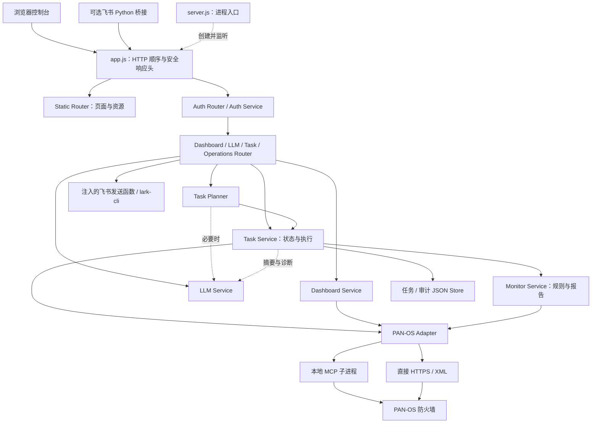

# 当前架构、重构原因与前后对比

更新：2026-09-28。以已提交功能基线 `bcb070a` 为准；本机尚未提交的登录页/10 分钟空闲超时不视为已发布。历史实施过程见 [五阶段记录](architecture-stage-1-2-summary.md)，当前安装方式见 [部署手册](DEPLOY.md)。

## 1. 结论：分层单体，不是另起一套系统

五阶段重构把原先集中在 `webui/server.js` 中的通信、执行、模型、路由和装配职责拆开。现在该文件只创建应用、监听端口、启动 MCP 连接。原生 Node.js HTTP、主要 API 路径和前端保留，没有迁移到新的 Web 框架，没有新增数据库或消息队列。

随后原生接入深度巡检：复用既有 Task Service / Adapter，而不是把上游 Python skill 作为任意脚本执行。新巡检入口统一为 `monitor`，旧 `inspect` 记录仍可阅读。

部署时是一个 Web 后端进程及一个本地 MCP 子进程，飞书 Python 桥接可选。目录中的 Service 是同进程模块，不能理解为已具备微服务隔离、跨主机调度或水平扩容。

## 2. 为什么需要重构

| 原问题 | 调整 | 获得的收益与边界 |
| --- | --- | --- |
| HTTP、设备通信、模型与任务混在 `server.js` | 薄入口 + 依赖装配 + Router / Service / Adapter | 修改与排障可以定位职责；不是仅改文件名 |
| 任务状态、审批和审计由多条路径维护 | Task Service 统一创建、动作、执行和存储 | 避免 Router 各写一套状态；仍需测试防止新增旁路 |
| 前端确认不等于服务端授权 | 状态机、计划指纹、候选与 commit 确认 | 拒绝不合法状态和已改变的计划；不代替设备最小权限 |
| MCP/直连/模型依赖纠缠，测试易碰真设备 | 适配器边界与依赖注入 | 可用替身验证业务、契约和失败路径 |
| 新旧执行器并存、迁移不彻底 | 主运行链切换后删除已覆盖实现 | 清理了主 `webui` 的旧路径；`standalone/` 仍是历史副本 |
| 巡检中心与深度巡检结果不一致 | 单入口、单执行链、统一报告 | UI、导出、飞书摘要使用相同任务报告 |
| 工具失败可能被看成“健康” | 采集状态、风险、覆盖率分开呈现 | 明确未知/不支持；不是保证每台设备支持全部检查 |

## 3. 五阶段落在哪里

| 阶段 | 已落地职责 | 核心文件 |
| --- | --- | --- |
| 1：设备通信边界 | MCP 生命周期、工具调用、直接 PAN-OS HTTPS/XML、工具路由和凭据读取 | [panos-adapter.js](../webui/adapters/panos-adapter.js) |
| 2：任务业务与状态 | 创建/分发、查询/审计/诊断、候选解析、批量子任务、commit；任务/审计唯一入口 | [task-service.js](../webui/services/task-service.js)、[task-governance.js](../webui/lib/task-governance.js)、[task-planner.js](../webui/services/task-planner.js) |
| 3：模型服务 | 提供方、持久化选择、上下文、意图解析、摘要与诊断综合 | [llm-service.js](../webui/services/llm-service.js) |
| 4：服务与 Router | Dashboard / Auth Service；Auth、Dashboard、LLM、Task、Operations 和静态路由 | [api-routes.js](../webui/routes/api-routes.js)、[static-routes.js](../webui/routes/static-routes.js)、[dashboard-service.js](../webui/services/dashboard-service.js)、[auth-service.js](../webui/services/auth-service.js) |
| 5：应用装配 | `app.js` 实例化/注入依赖、固定请求顺序；`server.js` 仅为进程入口 | [app.js](../webui/app.js)、[server.js](../webui/server.js) |
| 后续：原生深度巡检 | 固定只读来源、33 项检查、超时/取消/互斥、中文报告、历史兼容与一键执行 | [monitor/service.js](../webui/services/monitor/service.js)、[monitor-ui.js](../webui/assets/monitor-ui.js) |

“五阶段完成”指上述职责迁移完成，不等于所有技术债、生产加固、跨平台安装或飞书双向连通性均已完成。

## 4. 当前请求和模块关系

实线表示运行调用或数据持久化关系，不表示每次请求都会经过全部模块。LLM 是可选分支；确定性深度巡检不需要先调用模型。

### HTTP 顺序必须保留

`createApp()` 的实际顺序：安全响应头 → Static Router → Auth Router/统一认证 → Dashboard → LLM → Tasks → Operations → 404，外围捕获异常返回 500。

首页和登录资源先可访问；登录接口由 Auth Router 单独处理，业务 API 才要求会话或内部令牌。否则会出现“登录请求先被认证拦住”的循环。404 由 `app.js` 的末尾响应处理，**不是声称所有 HTTP 逻辑都搬进单个 Router 文件**。

`app.js` 仍保留动作表、变更模板展示元数据、飞书发送/状态包装及主动操作续期接线；它不是空文件，也不是所有业务函数都已抽到独立模块。后续新执行逻辑应进对应 Service，不应重新堆回入口。

## 5. 三条关键执行链

### 5.1 创建与执行普通任务

1. Router 接收 `POST /api/task`，读取请求并检查 MCP 连接。
2. Task Planner 解析输入、设备与任务类型，必要时向 LLM Service 请求规划。
3. Task Service 创建/保存任务，再执行查询、审计或诊断等对应主体。
4. Adapter 统一处理工具和设备调用；Task Service 保存步骤、结果与状态。
5. 页面通过任务列表读取结果；Router 不直接写 `task.status` 或任务 JSON。

普通查询仍可能在部分工具失败时结束为 `done`，应阅读工具错误与结果完整性，不能仅凭蓝色完成标签判断设备健康。

### 5.2 深度健康巡检与报告

侧栏、概览快捷操作和任务中心入口直接发起 `深度健康巡检`；旧口令“完整巡检”“巡检”“inspect”也映射到同一种新 `monitor` 任务。

Task Service 负责同设备互斥、取消信号和状态；Monitor Service 按固定来源采集、缓存同次重复来源、逐项执行规则并组装报告。默认单来源最多 30 秒、整次最多 10 分钟，迟到结果不能覆盖取消状态。

**统一报告位置是 `task.result.monitor`**：

- 页面：`monitor-ui.js` 渲染风险、采集状态、覆盖率和证据。
- 导出：Task Service 从同一结果生成 JSON / HTML。
- 飞书：通知接口从同一结果生成摘要，不扫描旧 `reports/` 猜测最新文件。
- 历史：旧 `inspect` 保持旧结构展示，不补造新版检查覆盖率。

规则来自原生 `monitor/` 模块，没有新增任意 skill 上传后直接执行能力；上游目录/规则来源与许可见 [第三方声明](third-party/panos-monitor-NOTICE.md)。

### 5.3 候选、审批与 commit

任务路由把候选精确选择、批准、拒绝、确认和取消交给 `TaskService.actOnTask`，批量选择交给 `startBatchSelection`。服务负责状态转换、审计、子任务和统一 commit 编排。

候选修改与 commit 是不同阶段。`approve` / `select` 在允许状态下执行候选；`confirm` 才进入提交。批准/确认校验计划指纹，不能沿用已变化计划的旧确认。

Router 保留对应响应语义：任务不存在 404，非法操作/状态 400，计划指纹变化 409。取消阻止后续推进，不代表会自动撤销已经写入设备的候选配置，更不能等同于回滚已经完成的 commit。

## 6. 状态、数据和恢复归属

| 数据 | 唯一业务管理者 | 保存与恢复方式 |
| --- | --- | --- |
| 任务与步骤 | Task Service | 文件 Store 位于同一模块；内存列表、串行写队列、临时文件替换；默认保留 200 条 |
| 任务审计 | Task Service | 独立 Audit Store / JSON；清理任务不等于清理审计 |
| 新巡检报告 | Task Service | 随任务保存 `result.monitor`；历史/导出/通知读取同一份 |
| 流量全量明细 | Task Service 内存 Map | 运行期间分页与导出；磁盘只保留摘要/50 条预览，重启后全量不可恢复 |
| 认证、会话、内部令牌 | Auth Service | `cfgs/auth.json`；独立于防火墙 API Key |
| 模型配置与选择 | LLM Service | 模型配置文件和选择文件；模型调用日志在内存 |
| 概览、拓扑、指标与查询历史 | Dashboard Service | 聚合/缓存与内存历史；不是长期指标数据库 |
| 设备凭据与 MCP 状态 | PAN-OS Adapter / MCP | 配置或系统密钥链、子进程通信状态；不属于浏览器登录态 |

当前 Store 是 Task Service 内的实现与可注入接口，**没有另一个独立 Task Store 服务或数据库**。

重启加载时，`pending`、`running`、`executing`、`committing` 会改为失败并记录“控制台重启，任务中断”，保留历史但不自动重放。它不等于设备事务恢复；如果 commit 曾发出，操作者应核对设备作业结果，不能盲目重试。

进程内互斥和 JSON 原子替换不提供跨进程锁、跨文件事务、审计防篡改或多实例一致性。扩容前须另行设计这些边界。

## 7. 排障应按哪一层

| 现象 | 优先检查 |
| --- | --- |
| 页面无法访问 | HTTP 服务、进程、端口、资源路径 |
| 业务 API 返回 401 | Auth Service / 浏览器会话，不能先归因于防火墙 API Key |
| MCP 无法连接 | Node 版本、子进程路径、MCP 自身依赖与 stdio 握手 |
| PAN-OS 返回 403 | 设备凭据、角色权限、目标设备与密钥来源 |
| 巡检部分完成/不支持 | 固定来源返回形状、PAN-OS 版本、功能模式与证据覆盖 |
| 飞书发送失败 | CLI 路径、当前应用身份、群成员关系及权限 |

MP 的 OS CPU 估算不是 load average，也不承诺等于防火墙 WebUI 同期控制面均值；云端能打开网站不代表能访问内网设备。这些是指标与网络边界，不是 UI 重构就能消除的差异。

## 8. 已完成与仍待处理

已完成的职责拆分由路由契约、任务状态/恢复、审批/批量编排、Adapter、LLM、巡检规则、报告与 UI 回归覆盖。最近功能验收记录见 [巡检说明](深度健康巡检使用说明.md)，每次发布仍需重新执行测试。

未作为此次重构承诺交付的项目：

1. 正式安装包、统一用户数据目录、升级/卸载保留数据、签名/公证和跨平台验收。
2. 数据库、多实例、分布式任务队列、无限历史归档与自动断点续跑。
3. 多用户 RBAC/SSO、完整 TLS 校验、公网部署安全基线。
4. 所有 PAN-OS 型号/模式适配，例如 Advanced Routing，以及高流量窗口无遗漏分页。
5. 飞书桥接全部配置可移植与双向端到端验收；绿色心跳不是双向健康证据。
6. 本机独立未提交的登录页/10 分钟超时，依赖锁文件与运行时历史跟踪清理。

后续改动应继续遵守：Router 只做 HTTP 契约；Task Service 管状态；Monitor Service 管检查；Adapter 管设备传输；新功能复用这套主链，不维护第二套服务代码。
