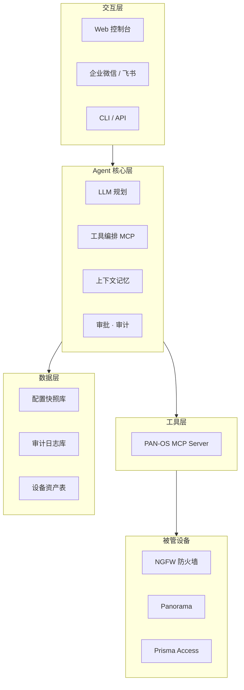

# Palo Alto Networks 防火墙管理 Agent — 开发规格说明书

| 项 | 值 |
|---|---|
| 版本 | v0.1（草案，待评审） |
| 状态 | 规划中 |
| 作者 | WorkBuddy + 用户 |
| 更新日期 | 2026-08-18 |

---

## 1. 项目概述

### 1.1 背景与目标

构建一个**对话式 AI Agent**，通过自然语言完成 Palo Alto Networks（PAN-OS）防火墙的日常管理与运维工作，覆盖：

- 配置查询与解释（接口、区域、路由、NAT、安全策略）
- 监控与告警（设备健康、会话、流量、威胁日志）
- 策略变更（新增/修改/删除/排序，带审批与回滚）
- 事件响应（封禁 IP、临时策略、到期回收）
- 日志分析与合规巡检

### 1.2 目标用户

- 安全运维工程师 / 安全管理员
- 形态：Web 对话界面 + 企业微信 / 飞书入口 + CLI

### 1.3 核心原则（不可妥协）

1. **默认只读**：写操作必须显式授权 + 审批
2. **写操作铁律**：预检 → 审批 → 执行 → 验证 → 回滚
3. **防幻觉**：工具输出结构化校验，Agent 不得编造配置值
4. **全量审计**：谁、何时、改了什么、为什么，全程留痕

---

## 2. 总体架构

### 2.1 五层架构



### 2.2 技术栈选型（建议）

| 层 | 选型 | 说明 |
|---|---|---|
| Agent 框架 | WorkBuddy / Dify / LangGraph | 工具编排 + 审批流能力 |
| 工具层 | **apius-tech/Palo-MCP**（首选） | 现成 117 工具，见第 3 章 |
| 数据层 | PostgreSQL | 快照、审计、资产 |
| 部署 | Docker / 管理网段内独立部署 | 仅 API 出向连接防火墙 |
| 密钥 | OS Keychain / Vault | API key 最小权限、定期轮换 |

---

## 3. 工具层：PAN-OS MCP Server（基线）

### 3.1 选型结论

直接复用社区成熟的 **apius-tech/Palo-MCP**（MIT），不重复造 API 层：

- **117 工具 / 16 模块**（v1.3.23+，已与源码逐一对账）
- 每个工具带安全标签：`[READ-ONLY]` / `[MODIFIES CONFIG]` / `[ADVANCED]`
- Zod 参数校验、XPath 配置管理、candidate 暂存 + 分步 commit
- 支持多防火墙（`firewall: <name>` 参数）与 Panorama
- API key 存 OS Keychain，默认关闭 TLS 证书校验（可配 `verify_ssl`）

> ⚠️ LobeHub 等收录页显示"51 工具"为旧版数据，已过时。以 v1.3.23+ 为准。

### 3.2 备选 / 补充

- `zm1990s/pan-os-mcp`：中文文档完善，巡检场景示例多，可参考其 Agent Prompt 设计
- 官方 XML/REST API：MCP 未覆盖的操作（如抓包、自定义 op）用 `run_op_command` 兜底

### 3.3 工具全量清单（117）

标签说明：`R`=READ-ONLY 只读，`W`=MODIFIES CONFIG 改配置，`A`=ADVANCED 任意命令。

#### System（4）

| 工具 | 标签 | 用途 |
|---|---|---|
| get_firewall_info | R | 系统信息：主机名/型号/序列号/版本 |
| get_ha_status | R | HA 状态与对端信息 |
| get_active_sessions | R | 活跃会话数统计 |
| get_system_resources | R | CPU/内存/磁盘占用 |

#### Network（10）

| 工具 | 标签 | 用途 |
|---|---|---|
| get_interfaces | R | 接口列表 |
| get_zones | R | 安全区域 |
| get_routing_table | R | 路由表 |
| get_arp_table | R | ARP 表 |
| get_vlans | R | VLAN |
| get_dhcp_leases | R | DHCP 租约 |
| get_dns_proxy | R | DNS 代理配置 |
| get_static_routes | R | 静态路由 |
| add_static_route | W | 新增静态路由 |
| delete_static_route | W | 删除静态路由 |

#### Security（18）

| 工具 | 标签 | 用途 |
|---|---|---|
| get_security_rules | R | 安全策略规则库 |
| add_security_rule | W | 新增安全策略 |
| delete_security_rule | W | 删除安全策略 |
| move_security_rule | W | 调整策略顺序 |
| set_security_rule_disabled | W | 启用/禁用策略 |
| get_security_profiles | R | 安全配置文件（防病毒/防入侵等） |
| get_security_profile_groups | R | 配置文件组 |
| get_pbf_rules | R | PBF（基于策略转发）规则 |
| add_pbf_rule | W | 新增 PBF 规则 |
| delete_pbf_rule | W | 删除 PBF 规则 |
| move_pbf_rule | W | 调整 PBF 顺序 |
| set_pbf_rule_disabled | W | 启用/禁用 PBF |
| get_dos_profiles | R | DoS 防护配置 |
| get_qos_rules | R | QoS 规则 |
| add_qos_rule | W | 新增 QoS 规则 |
| delete_qos_rule | W | 删除 QoS 规则 |
| move_qos_rule | W | 调整 QoS 顺序 |
| set_qos_rule_disabled | W | 启用/禁用 QoS |

#### Objects（16）

| 工具 | 标签 | 用途 |
|---|---|---|
| get_address_objects | R | 地址对象 |
| add_address_object | W | 新增地址对象 |
| delete_address_object | W | 删除地址对象 |
| get_address_groups | R | 地址组 |
| add_address_group | W | 新增地址组 |
| delete_address_group | W | 删除地址组 |
| get_service_objects | R | 服务对象 |
| add_service_object | W | 新增服务对象 |
| delete_service_object | W | 删除服务对象 |
| get_service_groups | R | 服务组 |
| add_service_group | W | 新增服务组 |
| delete_service_group | W | 删除服务组 |
| get_application_filters | R | 应用过滤器 |
| get_tags | R | 标签 |
| add_tag | W | 新增标签 |
| delete_tag | W | 删除标签 |

#### NAT（5）

| 工具 | 标签 | 用途 |
|---|---|---|
| get_nat_rules | R | NAT 规则 |
| add_nat_rule | W | 新增 NAT 规则 |
| delete_nat_rule | W | 删除 NAT 规则 |
| move_nat_rule | W | 调整 NAT 顺序 |
| set_nat_rule_disabled | W | 启用/禁用 NAT |

#### User-ID（3）

| 工具 | 标签 | 用途 |
|---|---|---|
| get_userid_mappings | R | 用户-IP 映射 |
| get_userid_groups | R | 用户组 |
| get_userid_config | R | User-ID 配置 |

#### Admin（3）

| 工具 | 标签 | 用途 |
|---|---|---|
| get_admins | R | 管理员账号 |
| get_admin_roles | R | 管理员角色 |
| get_auth_profiles | R | 认证配置 |

#### VPN（3）

| 工具 | 标签 | 用途 |
|---|---|---|
| get_ipsec_tunnels | R | IPSec 隧道及状态 |
| get_globalprotect_users | R | GlobalProtect 在线用户 |
| get_globalprotect_config | R | GlobalProtect 配置 |

#### Panorama（29，均为 panorama_ 前缀）

| 工具 | 标签 | 用途 |
|---|---|---|
| get_device_groups | R | 设备组 |
| get_device_group_hierarchy | R | 设备组层级 |
| get_templates / get_template_stacks | R | 模板 / 模板栈 |
| get_managed_devices | R | 受管设备 |
| get_managed_device_software | R | 受管设备软件版本 |
| get_commit_status / get_push_status | R | commit / push 状态 |
| get_ha_status | R | Panorama HA |
| get_collector_groups / get_log_collectors | R | 日志收集器 |
| get_shared_address_objects / get_shared_address_groups | R | 共享地址对象/组 |
| get_shared_service_objects / get_shared_service_groups | R | 共享服务对象/组 |
| get_shared_security_profiles / get_shared_profile_groups | R | 共享安全配置 |
| get_pre_rules / get_post_rules | R | Pre / Post 规则 |
| get_device_group_nat_rules | R | 设备组 NAT 规则 |
| add_pre_rule / delete_pre_rule / move_pre_rule | W | Pre 规则增删移 |
| add_post_rule / delete_post_rule / move_post_rule | W | Post 规则增删移 |
| add_device_group_nat_rule / delete_device_group_nat_rule / move_device_group_nat_rule | W | 设备组 NAT 增删移 |

#### Logs（5）

| 工具 | 标签 | 用途 |
|---|---|---|
| get_traffic_logs | R | 流量日志 |
| get_threat_logs | R | 威胁日志 |
| get_system_logs | R | 系统日志 |
| get_url_filter_logs | R | URL 过滤日志 |
| get_config_logs | R | 配置变更日志 |

#### Threat（4）

| 工具 | 标签 | 用途 |
|---|---|---|
| get_wildfire_status | R | WildFire 状态 |
| get_antivirus_version | R | 防病毒版本 |
| get_content_versions | R | 内容库版本 |
| get_url_categories | R | URL 分类 |

#### Certificates（7）

| 工具 | 标签 | 用途 |
|---|---|---|
| get_certificates | R | 证书列表 |
| get_decryption_rules | R | 解密规则 |
| add_decryption_rule | W | 新增解密规则 |
| delete_decryption_rule | W | 删除解密规则 |
| move_decryption_rule | W | 调整解密规则顺序 |
| set_decryption_rule_disabled | W | 启用/禁用解密规则 |
| get_decryption_profiles | R | 解密配置文件 |

#### Licenses（2）

| 工具 | 标签 | 用途 |
|---|---|---|
| get_licenses | R | 许可证列表 |
| get_license_usage | R | 许可证使用情况 |

#### Config（5）

| 工具 | 标签 | 用途 |
|---|---|---|
| set_config | W | XPath 写入配置（candidate） |
| delete_config | W | XPath 删除配置 |
| commit | W | 提交防火墙配置 |
| panorama_commit | W | 提交 Panorama 配置 |
| panorama_push_to_devices | W | 推送配置到受管设备 |

#### Utility（2）

| 工具 | 标签 | 用途 |
|---|---|---|
| run_op_command | A | 执行任意 op 命令（CLI 等价） |
| get_config_xpath | R | XPath 读取任意配置 |

#### Firewalls（1）

| 工具 | 标签 | 用途 |
|---|---|---|
| list_firewalls | R | 列出已配置的防火墙目标 |

**标签统计**：R 只读 70 · W 改配置 46 · A 高级 1

---

## 4. 核心能力模块（分阶段交付）

### 4.1 P0 — 只读底座（MVP）

| 能力 | 说明 | 主要工具 |
|---|---|---|
| 设备总览 | 系统信息、HA、资源、会话 | get_firewall_info / get_ha_status / get_system_resources / get_active_sessions |
| 配置查询与解释 | 策略/对象/NAT/接口的自然语言查询与含义解读 | get_security_rules / get_address_objects / get_nat_rules / get_interfaces / get_zones |
| 监控查询 | 流量/威胁/系统日志、许可证 | get_traffic_logs / get_threat_logs / get_licenses |
| 多设备切换 | 多防火墙/多租户定位 | list_firewalls + firewall 参数 |

**DoD（完成定义）**：上述查询全部可用自然语言触发并正确格式化输出；只读模式无法触发任何 W 工具。

### 4.2 P1 — 运维操作（带安全闭环）

| 能力 | 说明 | 主要工具 |
|---|---|---|
| 策略变更 | 新增/修改/删除/排序安全策略，candidate 暂存后审批 commit | add/delete/move/set_*_disabled_security_rule + commit |
| 对象管理 | 地址/服务对象与组的增删 | add/delete_address_object/group、service_object/group |
| 事件响应 | 封禁 IP（动态地址组）、临时策略、到期自动回收 | add_address_object + set_config + commit |
| 日志分析 | 威胁/流量日志自然语言排查 | get_threat_logs / get_traffic_logs |
| 配置回滚 | commit 前快照、失败/误操作回滚 | get_config_xpath + set_config |

**DoD**：所有写操作必须走审批流（见 6.3）；每个变更生成审计记录；具备一键回滚。

### 4.3 P2 — 智能化

| 能力 | 说明 |
|---|---|
| 合规巡检 | 自动生成安全基线检查报告（等保 2.0 / PCI-DSS 相关项） |
| 智能诊断 | 连通性排查（路由/ARP/会话联动分析）、抓包分析（run_op_command） |
| 变更闭环 | 申请 → 审批 → 执行 → 验证 → 审计归档全自动 |
| 定时巡检 | 周期任务自动巡检并产出日报 |

---

## 5. 关键技术设计

### 5.1 工具调用约定

- 每个 MCP 工具映射为一个 Agent 动作，入参走 Zod 校验
- 查询类结果统一转 Markdown 表格输出
- 所有工具调用记录 `{工具, 参数, 结果摘要, 耗时}`

### 5.2 写操作闭环（硬性流程）

```
Agent 提出变更 → 预检(dry-run/candidate 校验) → 人工审批(展示 diff)
→ 执行(set_config) → commit → 验证(get_*) → 审计归档
失败 → 自动回滚（还原快照 + 重新 commit）
```

- 预检必须展示：变更内容、影响范围（涉及策略/接口）、风险等级
- 审批超时（默认 15 分钟）自动取消

### 5.3 防幻觉策略

- 高危动作模板化：封禁/删除/全局配置不允许 LLM 自由生成 XML，只允许选择预设模板 + 填参数
- 工具输出严格校验：非预期格式/空值需重试或报错，不推断
- 所有 IP/网段/端口参数强制格式校验（Zod + ip-address 等库）

### 5.4 上下文与记忆

- 会话内：多轮状态（当前设备、当前策略集）
- 跨会话：设备台账、常用对象、历史变更偏好（存数据层）

---

## 6. 安全与权限设计

| 项 | 设计 |
|---|---|
| 权限模型 | RBAC：viewer（只读）/ operator（写，需审批）/ admin（写+审批） |
| 只读模式 | 默认开启；operator 以上才可请求写操作 |
| 高危操作 | 封禁、删策略、全局配置、commit：双人复核（第二人确认） |
| 审批流 | 变更详情 + diff 展示 → 审批人确认 → 执行；超时自动取消 |
| 审计 | 全量记录：操作人、时间、设备、工具、参数、结果、审批人 |
| 凭证 | API key 存 OS Keychain，最小权限（只读 key 给 viewer），定期轮换 |
| 网络隔离 | Agent 部署管理网段，仅 API 出向，禁用证书校验需显式配置 |

---

## 7. 数据层设计（草案）

```sql
-- 设备资产
devices(id, name, host, model, panos_version, api_key_ref, mode, created_at)

-- 配置快照（commit 前自动抓取）
config_snapshots(id, device_id, xpath, xml_content, created_at)

-- 变更记录（每次写操作闭环）
change_records(id, device_id, user, action, tool, params, diff,
               status, approver, rollback_snapshot_id, created_at)

-- 审计日志
audit_logs(id, ts, user, device_id, tool, params_hash, result_status)

-- 审批任务
approvals(id, change_id, requester, approver, status, timeout_at)
```

---

## 8. 交互示例

| 用户输入 | Agent 行为 |
|---|---|
| "看看 HQ 防火墙现在状态怎么样" | get_firewall_info + get_ha_status + get_system_resources → 汇总表格 |
| "哪些策略放行了 internet 到 DMZ？" | get_security_rules → 过滤 → 解释每条的 action/用户/应用 |
| "封禁 1.2.3.4 出站" | 模板化：建地址对象 + 加进封禁组 → 展示 diff → 审批 → commit → 验证 → 审计 |
| "把 block-social-media 移到 allow-web 上面" | move_security_rule → 预检展示新顺序 → 审批 → 执行 |

---

## 9. 开发路线图

| Phase | 内容 | 周期 | 里程碑验收 |
|---|---|---|---|
| 1 | 环境搭建 + P0 只读能力 + 自然语言查询 | 2-4 周 | P0 DoD 全过 |
| 2 | P1 策略/对象变更 + 审批流 + 回滚 | 4-6 周 | P1 DoD 全过，沙箱演练 |
| 3 | 事件响应 + 日志分析 + 合规巡检 | 6-8 周 | 生产试点 |
| 4 | 多租户 + SIEM/工单集成 + 定时巡检 | 持续 | 正式上线 |

---

## 10. 风险与缓解

| 风险 | 缓解 |
|---|---|
| 变更影响线上流量 | 写操作双保险：预检 + 审批 + 回滚，缺一不可 |
| PAN-OS 版本差异（9/10/11） | API 版本协商 + 兼容测试矩阵 |
| LLM 幻觉导致错误配置 | 高危动作模板化 + 结构化校验 |
| API key 泄露 | Keychain 存储 + 最小权限 + 轮换 |
| 多设备误操作 | firewall 参数必填校验 + 变更前二次确认目标设备 |

---

## 11. 参考资源

- apius-tech/Palo-MCP：https://github.com/apius-tech/Palo-MCP
- zm1990s/pan-os-mcp（中文巡检示例）：https://github.com/zm1990s/pan-os-mcp
- PAN-OS XML API 文档：https://docs.paloaltonetworks.com/pan-os/11-1/pan-os-panorama-api

---

## 12. 数据模型（存储演进依据）

> 目标：无论未来切 SQLite 还是 PostgreSQL，都按这套四表模型设计，迁移零重设计。
> 当前实现为 JSON 文件（`cfgs/tasks.json` + 内存），表结构即 JSON 字段的规范化投影。

### 12.1 四张核心表

```
tasks（任务）                        audit（审计）
─────────────────────────────       ─────────────────────────────
id            INTEGER PK AUTOINC    id            INTEGER PK AUTOINC
type          TEXT    （query/      task_id       INTEGER  → tasks.id
                 inspect/diag/      action        TEXT    （approve/select/
                 audit/change）                   confirm/reject/cancel）
status        TEXT                  operator      TEXT    （web/feishu）
input         TEXT                  params_json   TEXT
plan          TEXT                  result_json   TEXT
llm           TEXT    （provider）  created_at    DATETIME（索引）
firewall      TEXT
steps_json    TEXT
result_json   TEXT
created_at    DATETIME（索引）

llm_logs（LLM 决策）                 metrics（指标采样·报表用）
─────────────────────────────       ─────────────────────────────
id            INTEGER PK AUTOINC    ts            DATETIME（索引·时序）
provider      TEXT                  kpi_json      TEXT
role          TEXT    （classify/     └─ 设备/HA/会话/负载/许可快照
                 synthesize）       source        TEXT    （console）
input         TEXT
output        TEXT
ms            INTEGER
created_at    DATETIME（索引）
```

### 12.2 索引设计

| 表 | 索引 | 支撑查询 |
|---|---|---|
| tasks | `(created_at)`、`(status)` | 按时间/状态筛任务 |
| audit | `(created_at)`、`(task_id)` | 审计追溯、任务→操作链 |
| llm_logs | `(created_at)` | LLM 决策时间线 |
| metrics | `(ts)` | 时间范围聚合出趋势图 |

### 12.3 迁移策略（JSON → SQLite → PostgreSQL）

1. **当前**：JSON 文件，`persistTasks/loadTasks` 双写（已加串行写锁）
2. **切 SQLite**（better-sqlite3）：只改存储层函数，表结构按 12.1 建；SQL 方言与 PG 通用
3. **切 PostgreSQL**（pg 连接池）：多客户端共享时启用；连接串走环境变量，行级锁天然解决并发

> 关键设计：业务代码不直接碰存储实现，统一走 `persistTasks()/loadTasks()` 与未来 `store.get/set` 抽象层，切换时只换一个文件。
